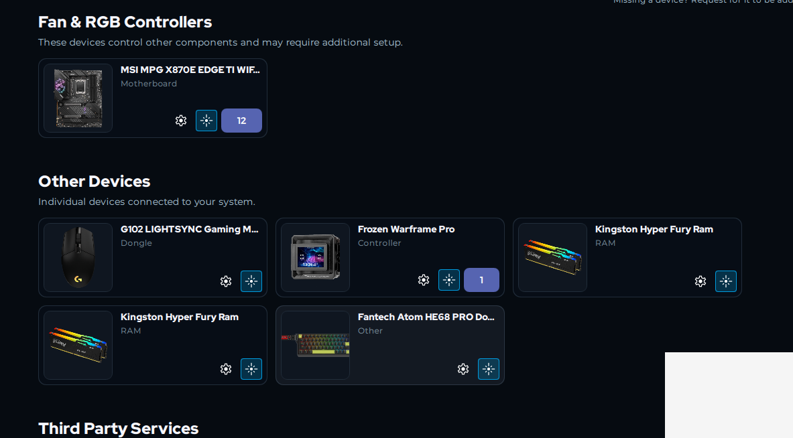

# Fantech Atom HE68 PRO toolkit

An unofficial, capture-driven Python and SignalRGB toolkit for the Fantech Atom
HE68 PRO. It documents the keyboard's HID protocol and provides tested wired
lighting control, per-key RGB/GIF playback, replay tools for captured settings,
and experimental 2.4 GHz dongle support.

This project is community reverse engineering. It is not affiliated with or
endorsed by Fantech or SignalRGB.

## Install

```powershell
py -m pip install -e .
```

For the test suite, install the development extra instead:

```powershell
py -m pip install -e ".[dev]"
py -m pytest -q
```

`hidapi` may need an operating-system HIDAPI library/driver depending on your Python
distribution.

## What works

- Wired static RGB and the 19 captured onboard lighting modes.
- Wired per-key Custom RGB, including GIF playback.
- The complete 68-key LED address map.
- Capture/replay tooling for tested performance, remapping, dead-zone, polling-rate,
  stability, and adaptive-calibration changes.
- A working wired SignalRGB plugin.
- A capture-backed dongle packet generator and SignalRGB plugin. The wireless
  transport remains experimental and may not stream reliably on every setup.

## Quick examples

```powershell
py demo.py --red
py demo.py --green
py demo.py --blue
py demo.py --rgb 255 128 32
py demo.py --red --record-dir captures/sessions
py tools/play_gif_lighting.py gifs/nyan_cat.gif --loop
```

The supplied official-software capture is embedded as the verified static-color
baseline, so no environment template is required. Each wired command sends one
64-byte output report and waits for an acknowledgement. Use `--verbose` to log
complete host and device reports.

`--record-dir` writes one capture session containing every outbound packet sent by
that command, every inbound packet read from the device, UTC timestamps, and
request/ACK pair links. `--capture` records inbound observations until Ctrl+C; it
cannot intercept commands sent by a separate official-software process.

## SignalRGB



For a smaller download containing only the two plugins and a step-by-step setup
guide, use the standalone
[Fantech HE68 PRO SignalRGB repository](https://github.com/Sinshro/fantech-he68-pro-signalrgb).

Copy the plugin matching the active connection into
`%USERPROFILE%\Documents\WhirlwindFX\Plugins`, then fully restart SignalRGB:

- `signalrgb/Fantech_Atom_HE68_PRO.js` for wired USB.
- `signalrgb/Fantech_Atom_HE68_PRO_Dongle.js` for the 2.4 GHz receiver.

Close the official configurator and Python lighting tools first because only one
application should own the vendor HID endpoint. See
[`signalrgb/README.md`](signalrgb/README.md) for status and limitations.

## Verified wired protocol surface

The only packet fields encoded by this project are:

| Bytes | Direction | Verified meaning/value |
| --- | --- | --- |
| `0..2` | host | `AA 23 10` |
| `9..12` | host | `R G B A`; `A` is sent as verified `FF` |
| `22..23` | host | `AA 55` terminator |
| `24..63` | host | zero padding |
| `0..2` | device ACK | `55 23 10` |

Bytes `3..8` and `13..21` are **TODO: experimentally determine**. The toolkit
preserves their values from the supplied official-software capture.
Additional commands should be added only after capturing and documenting their
packets.

## Safety note

This is a reverse-engineering toolkit, not a complete device driver. Test changes on
hardware you control, retain packet captures, and do not infer new field meanings
from the currently unknown bytes.

## Expansion layout

- `fantech_he68.protocol`: verified packet constants and builders only.
- `fantech_he68.device`: HIDAPI enumeration, transport, packet logging, and ACK checks.
- `fantech_he68.custom_lighting`: capture-backed per-key RGB packet generation.
- `signalrgb/`: local wired and experimental dongle plugins.

See [protocol notes](docs/PROTOCOL.md), [architecture](docs/ARCHITECTURE.md), and
the [developer guide](docs/DEVELOPING.md).

## Capture-first workflow

The capture database is rooted at `captures/`, grouped by feature category. Each
wizard capture contains `session.json`, a lossless `session.bin`, generated
`metadata.json`, and `notes.md`. Do not add a capture reconstructed from a guessed
command.

```powershell
# Paste tools/webhid_recorder.js into the official software's DevTools once. It
# provides Start/Stop/Save controls, a live packet view, validates traffic, and
# downloads after a single request + ACK. Then organize it with no file moving.
python tools/capture_wizard.py

# Decode only documented fields, or compare two real captures.
python tools/decode.py captures/lighting/static_red
python tools/diff_packets.py captures/lighting/static_red captures/lighting/static_green --markdown

# Replay an observed host packet and require the 55 23 10 ACK.
python tools/replay.py captures/lighting/static_red

# Replay every observed packet in a batch capture, holding each effect for 5 seconds.
python tools/replay_sequence.py lighting/capture.json --delay 5

# Replay one complete Custom-mode update (the capture groups each update into 10 reports).
python tools/replay_custom.py "lighting/capture (1).json" --group 1 --select-custom

# Regenerate capture-linked protocol pages.
python tools/generate_docs.py

# Browse captures, packet bytes, confidence, notes, and adjacent-capture diffs.
python tools/protocol_explorer.py
```

`database/bytes.json` is the confidence-controlled byte dictionary. Its values are
limited to `Verified`, `High`, `Medium`, `Low`, or `Unknown`; unexplained offsets
remain `UNKNOWN`.
