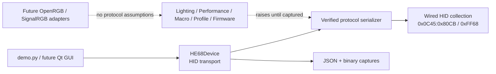

# Architecture

Only `HE68Device.set_color()` has a verified serialized command. The remaining
protocol classes are explicit capability boundaries and raise `NotImplementedError`.

## Future modules

- `features/`: capture-backed lighting, performance, macro, profile, and firmware work.
- `backends/`: adapter interfaces for OpenRGB and SignalRGB.
- `ambient/`: modular desktop-capture backends; no keyboard transmission is allowed
  until a PC-sync command is captured.
- `gui.py`: optional Qt UI once each user-visible control has a verified capability.
